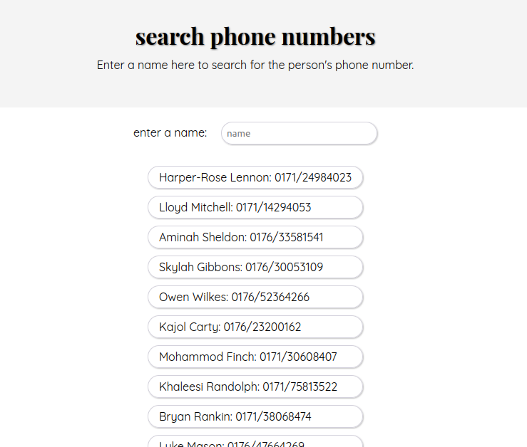

# phonebook

## filter function for phone numbers

### about project
+ simple graphical user interface 
    - input field, search Name
    - autocomplete, not case-sensitive
    - use JSON-data
    - the design comes later

### Developed With
    - HTML5
    - CSS3
    - JavaScript
    - React

### Used Tools
- [Google Fonts](https://fonts.google.com/)
- [Visual Studio Code](https://code.visualstudio.com/)

### Contact
Mail: <mine.erber@gmx.de> 
GitHub: [wilhelmine-erber](https://github.com/wilhelmine-erber) 
LinkedIn: [wilhelmine-erber](https://www.linkedin.com/in/wilhelmine-erber-248491217/)
